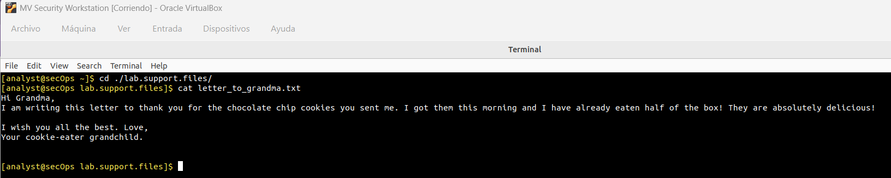
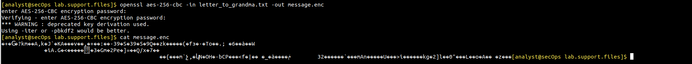
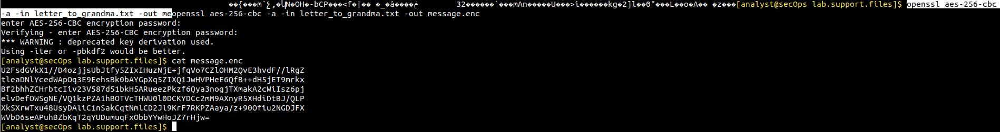
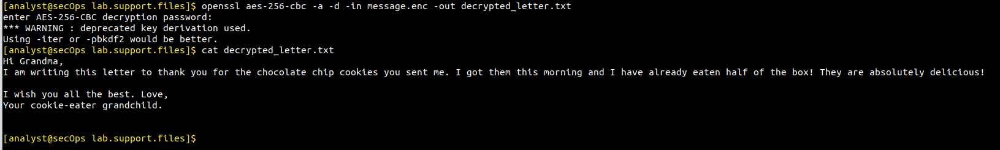

# Laboratorio: Cifrado y Descifrado de Datos con OpenSSL

## Descripción
Este laboratorio práctico simula una operación de seguridad defensiva enfocada en la protección de la confidencialidad de la información. Utilizando la herramienta OpenSSL en un entorno Linux (Security Workstation), se implementa criptografía simétrica avanzada (AES-256-CBC) para cifrar activos de texto en reposo, resolver desafíos de transporte mediante codificación Base64 y verificar el ciclo completo de recuperación forense y descifrado.

---

## Objetivos
* Comprender y aplicar criptografía simétrica mediante el algoritmo AES de 256 bits.
* Identificar las diferencias visuales y operativas entre el almacenamiento de datos binarios cifrados y datos codificados en Base64.
* Demostrar la capacidad de asegurar información confidencial frente a riesgos de lectura no autorizada en sistemas de archivos.
* Validar el flujo completo de descifrado para garantizar la disponibilidad e integridad operativa para usuarios legítimos.

---

## Tecnologías Utilizadas
* **Sistema Operativo:** Linux (Security Workstation / Entorno de terminal Bash).
* **Herramienta Criptográfica:** OpenSSL (versión estándar de línea de comandos).
* **Algoritmo de Cifrado:** AES-256-CBC (Advanced Encryption Standard con claves de 256 bits).
* **Codificación de Transporte:** Base64.

---

## Topología / Estructura del Directorio de Trabajo
El laboratorio se ejecuta de manera local dentro del entorno de soporte asignado para analistas bajo la siguiente estructura de archivos:

* Carpeta base: `/home/analyst/lab.support.files/`
  * `letter_to_grandma.txt` - Archivo original en texto plano.
  * `message.enc` - Archivo resultante cifrado.
  * `decrypted_letter.txt` - Archivo recuperado tras el descifrado.

---

## Desarrollo Paso a Paso

### 1. Inspección del Activo Original
Como medida inicial de auditoría y reconocimiento, se verifica el contenido del archivo objetivo para identificar la sensibilidad de los datos expuestos en texto plano.

**Comando utilizado:**
```bash
cd ./lab.support.files/
cat letter_to_grandma.txt
```

**Evidencia visual:**

*Imagen 1: Visualización del contenido original en texto plano.*

---

### 2. Cifrado Simétrico Básico (AES-256)
Para proteger la confidencialidad del archivo frente a accesos no autorizados en el sistema de archivos, se aplica cifrado simétrico fuerte utilizando AES de 256 bits.

**Comando utilizado:**
```bash
openssl aes-256-cbc -in letter_to_grandma.txt -out message.enc
```
*Nota de seguridad: El sistema solicita una contraseña maestra robusta y su posterior confirmación para derivar la clave criptográfica.*

**Verificación de seguridad (Intento de lectura binaria):**
Al intentar leer el archivo cifrado resultante (`message.enc`) mediante la salida estándar, la terminal muestra símbolos corruptos y caracteres no imprimibles, evidenciando que la entropía del archivo fue alterada con éxito.

```bash
cat message.enc
```

**Evidencia visual:**

*Imagen 2: Comportamiento de la terminal al intentar leer datos binarios cifrados sin codificación previa.*

---

### 3. Optimización para Transporte Seguro (Capa Base64)
Para resolver problemas operativos de compatibilidad al transferir archivos cifrados a través de canales basados en texto, se re-cifra el archivo incorporando la codificación Base64 mediante la bandera `-a`.

**Comando utilizado:**
```bash
openssl aes-256-cbc -a -in letter_to_grandma.txt -out message.enc
```

**Verificación del formato seguro:**
```bash
cat message.enc
```

**Evidencia visual:**

*Imagen 3: Archivo cifrado representado en bloques ordenados de texto ASCII seguro.*

---

### 4. Ciclo de Recuperación y Descifrado Forense
Se valida la disponibilidad de la información simulando el rol del destinatario legítimo que posee la contraseña y el archivo cifrado para restaurar el texto original.

**Comando utilizado:**
```bash
openssl aes-256-cbc -a -d -in message.enc -out decrypted_letter.txt
```
*Desglose de parámetros:* 
* `-d`: Indica operación de *decrypt* (descifrado).
* `-a`: Ordena decodificar el formato Base64 antes de procesar el bloque AES.

**Verificación de éxito:**
```bash
cat decrypted_letter.txt
```

**Evidencia visual:**

*Imagen 4: Restauración íntegra del documento original tras el proceso de descifrado.*

---

## Comandos Utilizados (Resumen Técnico)

| Comando | Descripción / Propósito de Ciberseguridad |
| :--- | :--- |
| `cat [archivo]` | Visualización de archivos en texto plano para auditoría de contenido. |
| `openssl aes-256-cbc ...` | Cifrado simétrico de datos en reposo utilizando un estándar robusto (AES-256). |
| `... -a ...` | Aplica o interpreta codificación Base64 para un transporte seguro de bytes binarios. |
| `... -d ...` | Invierte la operación matemática de cifrado para descifrar el archivo de entrada. |

---

## Conceptos Aprendidos
* **Criptografía Simétrica:** Uso de una clave secreta compartida (contraseña) para cifrar y descifrar la información de manera eficiente.
* **Control de Confidencialidad:** Mitigación del riesgo de brechas de datos ante ataques de lectura local de archivos.
* **Codificación vs. Cifrado:** Entendimiento de que Base64 no es un método de seguridad ni cifrado, sino un mecanismo de representación de datos diseñado para evitar corrupción en canales de texto.

---

## Posibles Mejoras
* Reemplazar la derivación de claves obsoleta por estándares modernos recomendados (como `-pbkdf2` o iteraciones adicionales `-iter`) para incrementar la resistencia contra ataques de fuerza bruta sobre la contraseña.
* Implementar cifrado asimétrico (GPG/PGP) en escenarios donde la clave secreta no pueda compartirse de forma segura previamente.

---

## Conclusión
Este laboratorio demuestra habilidades fundamentales para puestos de soporte de infraestructura, analistas SOC Junior y Blue Team, evidenciando la capacidad de proteger archivos sensibles en sistemas operativos Linux mediante criptografía estándar de la industria y garantizando la correcta manipulación de payloads cifrados.
